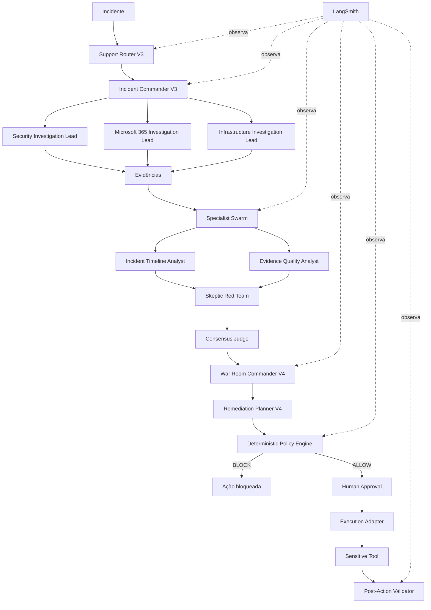

# 🛡️ SupportOps War Room

> Sistema multiagente para investigação e resposta a incidentes com **OpenAI Agents SDK**, governança determinística, aprovação humana e observabilidade end-to-end com **LangSmith**.


## Visão geral

O **SupportOps War Room** é um laboratório de arquitetura agentic voltado a incidentes que podem envolver, ao mesmo tempo, **identidade e autenticação**, **Microsoft 365** e **infraestrutura**.

O projeto não entrega a decisão diretamente a uma única LLM. Em vez disso, separa investigação, evidência, análise especializada, consenso, governança, aprovação humana, execução controlada e validação pós-ação.

A ideia central é simples:

> **LLM pensa. Tools observam. Agentes analisam. Commander decide. Policy controla. Humano autoriza. Tool executa. Validator verifica. LangSmith audita.**

## Arquitetura



## Camadas do sistema

| Camada | Responsabilidade |
|---|---|
| Router | Classificar e encaminhar o incidente |
| Incident Commander | Coordenar as investigações iniciais |
| Investigation Leads | Coletar evidências de Security, M365 e Infra |
| Specialist Swarm | Analisar correlação, identidade, forense, impacto, recuperação, mudança e comunicação |
| Timeline / Evidence Quality | Organizar sequência temporal e qualidade das evidências |
| Skeptic Red Team | Tentar derrubar hipóteses frágeis |
| Consensus Judge | Consolidar análises e atribuir confiança |
| War Room Commander | Tomar a decisão operacional final |
| Remediation Planner | Transformar a decisão em ações propostas |
| Policy Engine | Autorizar ou bloquear ações por regras determinísticas |
| Human Approval | Exigir aprovação explícita para ações sensíveis |
| Execution Adapter | Encapsular a execução das ações aprovadas |
| Post-Action Validator | Verificar resultado e risco residual |
| LangSmith | Rastrear incidentes, runs, latência, tokens e custo |

## Specialist Swarm

A análise paralela inclui agentes especializados como:

- Correlation Analyst
- Identity Threat Analyst
- Digital Forensics Analyst
- Business Impact Analyst
- Recovery Planner
- Change Risk Analyst
- Incident Communications
- Incident Timeline Analyst
- Evidence Quality Analyst
- Skeptic Red Team
- Consensus Judge

Essa separação ajuda a reduzir decisões monolíticas e permite comparar perspectivas antes da ação.

## Governança e Human-in-the-Loop

Uma das partes mais importantes do projeto é a separação entre **recomendação da IA** e **autorização operacional**.

```text
LLM / Planner
      ↓
Policy Engine
      ↓
 ALLOW / BLOCK
      ↓
Human Approval
      ↓
Execution Adapter
      ↓
Sensitive Tool
      ↓
Post-Action Validator
```

O Policy Engine é implementado em código e pode bloquear uma ação mesmo que um agente tenha recomendado sua execução.

Ações sensíveis são protegidas por aprovação humana nativa do Agents SDK, por exemplo:

- revogação de sessões de usuário;
- reset de MFA;
- alteração de permissão de mailbox;
- reinício de servidor.

## Exemplo de decisão

Em um dos cenários de laboratório, o sistema correlacionou eventos de identidade e Microsoft 365, enquanto tratou a degradação do servidor de arquivos como incidente independente.

```text
Prioridade       : P2
Confiança        : alta
Consensus Score  : 90/100
Evidence Score   : 86/100
Security Risk    : 78/100
```

O remediation planner propôs múltiplas ações, mas a camada de governança filtrou o plano:

```text
A1 revoke_sessions              -> ALLOW
A2 reset_mfa                    -> BLOCK
A3 change_mailbox_permission    -> BLOCK
A4 restart_server               -> BLOCK
```

Somente a ação autorizada chegou ao fluxo de aprovação humana.

## Evidência acima do relato

O projeto foi desenhado para distinguir:

- fato observado por tool;
- relato do usuário;
- hipótese técnica;
- lacuna de evidência.

Quando um relato entra em conflito com evidência coletada pelas tools, a decisão deve se apoiar na evidência observável, mantendo o conflito explícito na análise.

## Observabilidade com LangSmith

A versão atual usa um **root trace por incidente**, permitindo observar o fluxo completo de ponta a ponta.

Exemplo de métricas observadas em uma execução de laboratório:

```text
Latência total   : ~70 s
Tokens totais    : ~116 K
Custo observado  : ~US$ 0,077
```

Essas métricas mostraram um dos próximos desafios arquiteturais: reduzir reciclagem excessiva de contexto entre as fases do War Room.

> **Agents SDK faz acontecer. LangSmith mostra como aconteceu.**

## Estrutura atual

```text
supportops-war-room/
├── agente.py
├── agente-basico.py
├── handoff_demo.py
├── hybrid_demo.py
├── supportops_core_v3.py
├── supportops_pro.py
├── supportops_warroom.py
├── supportops_warroom_v2.py
├── supportops_warroom_v3.py
├── supportops_warroom_v4.py
├── supportops_langsmith_v5.py
├── requirements.txt
├── .env.example
├── .gitignore
├── docs/
├── examples/
└── outputs/
```

Os arquivos iniciais foram mantidos para mostrar a evolução do laboratório: de agentes simples e handoffs até uma War Room com swarm, consenso, policy engine e HITL.

## Configuração

Crie e ative um ambiente virtual Python e instale as dependências:

```powershell
python -m venv .venv
.\.venv\Scripts\Activate.ps1
pip install -r requirements.txt
```

Crie suas variáveis de ambiente a partir do exemplo:

```powershell
Copy-Item .env.example .env
```

Variáveis esperadas:

```text
OPENAI_API_KEY
LANGSMITH_API_KEY
LANGSMITH_PROJECT
```

Nunca envie o arquivo `.env` para o repositório.

## Execução

O launcher de observabilidade é:

```powershell
python supportops_langsmith_v5.py
```

Ele configura o processor do LangSmith e executa o War Room principal.

## Segurança do laboratório

> [!IMPORTANT]
> As integrações e ações sensíveis deste repositório são **simuladas para estudo e demonstração**. O código não deve ser tratado como automação pronta para produção contra Microsoft 365, Entra ID ou servidores reais.

Uma implementação de produção deve adicionar, entre outros controles:

- autenticação e autorização fortes;
- uso de UPN/Object ID imutável;
- Microsoft Graph com mínimo privilégio;
- trilha de auditoria persistente;
- gestão de segredos;
- idempotência;
- rollback;
- tool guardrails;
- testes automatizados de policy;
- segregação entre read-only e write actions.

## Roadmap

### V5.3 — Qualidade e isolamento
- suíte de evals automatizados;
- cenários de regressão;
- isolamento de sessão SQLite por incidente.

### V5.4 — Eficiência
- compactação de artefatos entre fases;
- redução de tokens;
- contexto seletivo por agente;
- otimização de custo e latência.

### V6 — Integrações reais read-only
- Microsoft Graph;
- identidade;
- Exchange / Microsoft 365;
- telemetria de infraestrutura.

### V7+
- API com FastAPI;
- frontend operacional;
- Docker;
- deployment em cloud;
- execução real com governança reforçada.

## Tecnologias e conceitos explorados

- OpenAI Agents SDK
- Python / AsyncIO
- Pydantic v2
- Tools e handoffs
- Agents-as-tools
- Structured outputs
- Parallel specialist analysis
- Deterministic Policy Engine
- Human-in-the-Loop
- Approval gates
- Post-action validation
- SQLite sessions
- LangSmith tracing
- Red Team
- Consensus engine
- Incident response architecture

## Autor

**Cláudio Santos**  
Cloud · Suporte Técnico · Microsoft 365 · Automação · Arquitetura de Agentes de IA

---

Este repositório representa a evolução de um laboratório de agentes até uma arquitetura de resposta a incidentes com múltiplas camadas de decisão e controle.